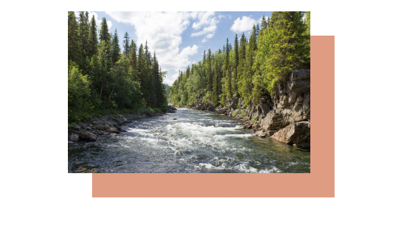

# CSS Layout

### 写真下背景色のずらし装飾

- 視線を集めると共にテーマカラーを自然に印象付けられる
- 疑似要素を使って背景色付きの四角形を作成して配置する方法もあるが、box-shadow なら１行で済む
- box-shadow は要素にシャドウ効果を追加するコードとして利用されることが多いが、ぼかしを０にすることで、影ではなく背景色付きのボックスとして表現できる
- X 軸へ 15px、Y 軸へ 15px ずらすよう設定している
- X 軸、Y 軸共にマイナスの値を設定することで、左上にボックスを配置できる

 

 

**注意点**

- 背景色付きのボックスは要素と同じサイズになるため、異なるサイズに変更したい場合は、疑似要素を使用する
